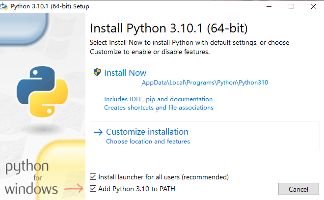
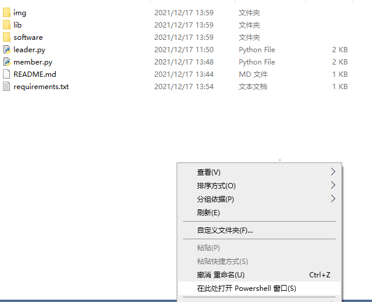
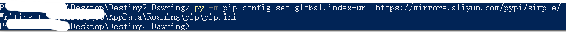

# Destiny2 Dawning
基于[OpenCV-Python](https://docs.opencv.org/4.x/d6/d00/tutorial_py_root.html)的命运2全自动挂机破碎王座刷曙光精华脚本。

万万没想到，我刚写好脚本，棒鸡就更新并修复了这个bug，现在已经刷不了，但还是放上来，做个纪念吧。

# 准备工作

## 安装python
首先去[Python官网](https://www.python.org/downloads/)下载python并安装。

**注意要点击这个添加python到环境变量的选项**

然后随便打开个

## 安装依赖
首先把整个项目文件夹下载下来，然后打开文件夹，按住`shift + 鼠标右键`，选择打开`powershell`。

输入：

    py

有输出，便是Python安装成功了，然后输入`exit()`退出。

修改`pip`的源为`阿里云源`输入：

    py -m pip config set global.index-url https://mirrors.aliyun.com/pypi/simple/

接着安装依赖：

    py -m pip install -r requirements.txt

## 截图
因为是基于[OpenCV-Python](https://docs.opencv.org/4.x/d6/d00/tutorial_py_root.html)，那么图肯定是必不可少的。

**因为根据每台电脑设置及分辨率不同，截图也不尽相同，为了提高识别效率，建议做好设置后重新截图并按照要求命名。**

*其中火力战队如果是三人的话，应该截两站图，因为考虑到两个队员加入队伍顺序可能不一样。*

*如果只有一个队员可以只截一张图，另一张不用管*

* 轨道的导航按钮----navigationBtn.png
* 目的地幽梦之城----cityBtn.png
* 破碎王座图标----throneBtn.png
* 副本开始按钮----startgameBtn.png
* 轨道火力战队----team.png team2.png
* ESC后更改角色----switchBtn.png
* 点击更改角色后确认按钮----confirmBtn.png
* 切换角色界面角色按钮----roleBtn.png
* 进入副本后左下角技能----abilities.png
* 组队错误提示----error.png
* 组队成功提示----success.png
* 聊天输入框右边输入法提示----input.png

关于组队失败怎么截图，直接在聊天框输入：

    /j 大佬#6666

然后即可看到组队失败了。

## 进度
车头当然要有破碎王座尾王的死亡进度啦，具体怎么卡这个进度可以去B站搜一下，很简单。

# 使用
## 车头
作为车头，也就是工具人视角，拿不到曙光精华的那种。

首先打开游戏，飞回轨道。

按照上面的步骤在文件夹打开`powershell`，然后输入：

    py ./leader.py

再点开游戏窗口（**建议将各种画面设置调到最低，并开启窗口模式**），就可以了等待队友加入了。

## 队员
作为队员，首先注意车头的名字。

因为命运2的这个聊天输入框，无法使用`pyautogui`或者`PyKeyboard`复制粘贴，绞尽脑汁也不行，所以只能取消救国。

### 车头为英文名

用记事本打开`member.py`，将这里的`inputCodeEn`前的`#`删除，并在`inputCodeCn`前加上`#`，于是变成这样。

    if compareImg('./img/input.png') != 0: 
        #inputCodeCn();
        inputCodeEn();

然后修改队伍码，就是这一句：

    pg.typewrite('/j bigBro#6666', interval = 0.2);

保存即可。

### 车头为中文名

**首先打开中文输入法，然后一次输入中文名每个字的首字母，再搜寻到完整的中文名，做到只输入首字母就可以打出中文名。**

然后用记事本打开`member.py`，修改这一句的首字母：

    pg.typewrite('dl1', interval = 0.2);

这个`数字1`不要漏了，因为这就是要用到中文输入法。

还要修改为车头的序号：

    pg.typewrite('#6666', interval = 0.2);

最后保存。

做完配置后首先打开游戏窗口（**建议将各种画面设置调到最低，并开启窗口模式**），飞回轨道，并将输入法调到中文，然后按`shift`使输入法在英文状态（就是按shift输入英文，再按shift又可以输入中文）。

按照上面的方法打开`powershell`，输入：

    py ./member.py

然后再点开游戏窗口即可。